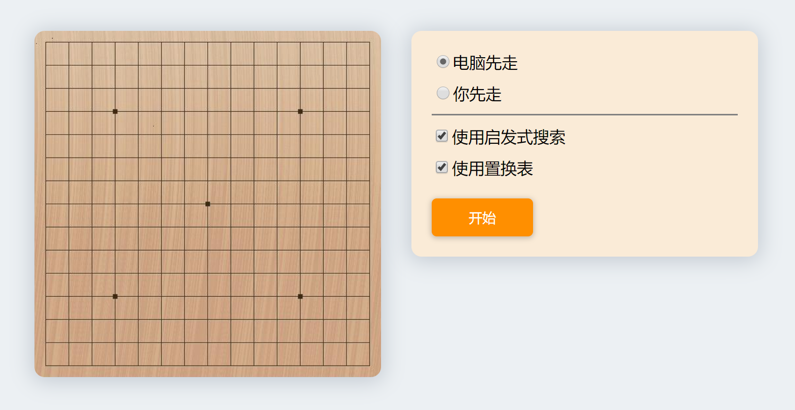

# 五子棋
## 简介
大二上人工智能引论大作业，一个普通的五子棋小游戏。

你可以设置是否使用启发式规则，以及是否使用置换表对搜索过程进行优化。

游戏过程中，你可以在卡片上看到搜索的相关数据。



## 体验本项目
GitHub Page：**[传送门](https://zhb2000.github.io/MyGobangAI/)**

### 温馨提示
不建议您使用2017年以前的旧版浏览器访问（CSS Grid 真好用
## 开发相关
使用 JavaScript 语言编写，用户界面使用 Vue.js 构建

（游戏控制逻辑写得很挫，别喷我

### 测试环境
- Google Chrome 79
- JavaScript ES 10

### 项目依赖
- [Vue.js](https://github.com/vuejs/vue)
- [Vue CLI](https://github.com/vuejs/vue-cli)

## 构建本项目
```
npm install
```

### Compiles and hot-reloads for development
```
npm run serve
```

### Compiles and minifies for production
```
npm run build
```

### Lints and fixes files
```
npm run lint
```

### Customize configuration
See [Configuration Reference](https://cli.vuejs.org/config/).